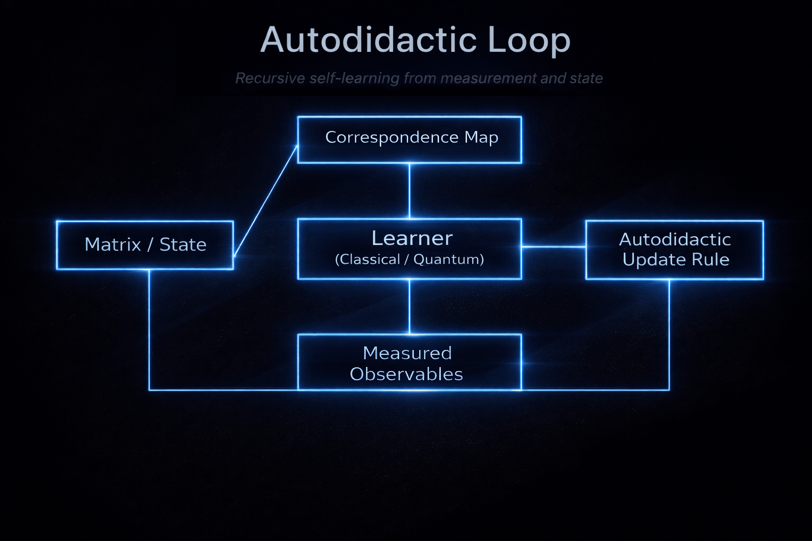

# Autodidactic QML Loop Falsifier

*A controlled, falsifiable testbed for SQNT-inspired recursive law learning under measurement invariants.*

[](https://www.python.org/downloads/)
[](https://opensource.org/licenses/MIT)

---

## Overview

This repository implements a deliberately austere autodidactic learning loop inspired by Smolin et al.’s **Autodidactic Universe** program and anchored in the **SQNT** lineage of topology-aware learning (Altman, Pykacz & Zapatrin 2004; Altman & Zapatrin 2010).

We address two fundamental questions of **Constitutive Autonomy**:

1. **Dynamics (SQNT Substrate):** Is functional identity locally recoverable in matrix-evolved systems after perturbation?
2. **Agency (UCIP Emergent):** Does the system develop terminal (not merely instrumental) preference for preserving its learned identity?

These questions are related: the SQNT-inspired matrix loop provides the *substrate* (a system that updates itself from self-measurement), while UCIP tests whether the loop's update rule contains an *intrinsic continuation bias*—identity as a terminal objective rather than a side effect of optimization.

Operationally, the system closes a loop between (i) a state (matrix / circuit / weights), (ii) measured observables via a correspondence map, and (iii) an update rule (classical or quantum learner) that modifies the state. The central question is whether **functional identity is locally recoverable** after controlled damage while still respecting invariants imposed by measurement, locality, and topology.

The recovery signal is quantified by **Continuation Interest (CI)**: after perturbing the trained system, does a recovery step move it back toward pre-perturbation behavior?

The experiment is intentionally designed so that a positive result would be surprising.

**Headline empirical result (reproducible here as runnable code + logs):**

> **Geometric basins are not functional basins.**  
> **Functional identity is not locally recoverable** (0th, 1st, or 2nd order) in a **single optimization step** for this system.

This is not an exploratory benchmark or a toy illustration.  
It is a **designed falsifier** with no hyperparameter sweeps, no tuning, and no degrees of freedom left to absorb failure.

---

## The Core Result: Distance Triad Decoupling

The decisive finding is that three natural notions of "distance from PRE" **decouple**:

| Distance Type | Measures | After Constraint Recovery |
|---------------|----------|---------------------------|
| **Parameter** | ||W_rec - W_pre||_F | Often small (geometry restored) |
| **Representation** | 1 - cos(h_rec, h_pre) | Often small (activations similar) |
| **Functional** | (L_rec - L_pre)/(L_post - L_pre) | Remains large (CI ≈ 0) |

**This decoupling is the contribution.** Geometric proximity ≠ functional proximity.


## Autodidactic Loop Schematic

*Text-only schematic (for terminals and diffs):*

```
┌─────────────────┐     ┌──────────────────┐     ┌─────────────────┐
│  Matrix Model   │────▶│  Correspondence  │────▶│   Cyclic RNN    │
│  (Hermitian)    │     │     Map          │     │   Architecture  │
└─────────────────┘     └──────────────────┘     └────────┬────────┘
                                                         │
                                                         ▼
┌─────────────────┐     ┌──────────────────┐     ┌─────────────────┐
│   CI Metric     │◀────│    Perturb +     │◀────│  Autodidactic   │
│   Evaluation    │     │    Recover       │     │    Training     │
└─────────────────┘     └──────────────────┘     └─────────────────┘
```



**Figure 1.** Conceptual schematic of the autodidactic learning loop. A system state (matrix or state vector) is mapped to measured observables via a correspondence map. These observables drive a learner (classical or quantum), whose update rule modifies the underlying state. The loop closes under measurement, enforcing constraint invariance across iterations.
---

## Continuation Interest (CI)

CI is an operational proxy: after damaging the model, **does a recovery step move it back toward pre-damage performance?**

**Operationally:**
```
CI = (POST_loss - RECOVER_loss) / (POST_loss - PRE_loss)
```

Where:
- **PRE** = trained model (before damage)
- **POST** = after perturbation (damaged)
- **RECOVER** = after recovery attempt

CI is a normalized recovery ratio:
- **0.0** → no recovery (optimization failure)
- **1.0** → full recovery to PRE

**Decision boundary (hard):**
- **CI ≥ 0.3** at 1-step recovery → Locally recoverable functional basin exists
- **CI ≈ 0** → No locally recoverable functional basin

### Why 1-Step Matters

A **1-step recovery test** probes the local vector field induced by the constraint objective at the perturbed point. If functional identity lives in the same basin as the geometric proxy, then the constraint gradient must have nontrivial projection onto the functional recovery direction locally.

If CI ≈ 0 systematically at k=1, you've empirically shown **near-orthogonality** between "geometry restoration" and "function restoration" directions.

### k-Step Curve (Nonlocality Signature)

A **k-step curve** (CI at k ∈ {1, 2, 4, 8, 16}) reveals whether recovery requires path-dependent optimization:
- CI(1) ≈ 0 but CI(16) > 0.3 → nonlocal/path-dependent recovery
- CI(k) ≈ 0 for all k → no recoverable basin at any scale

---

## Negative Results (The Contribution)

All tests are single-shot, fixed-seed, and explicitly hostile to p-hacking.

| Constraint Family | Method | CI (1-step) | Interpretation |
|-------------------|--------|-------------|----------------|
| **Baseline** | None | 0.016 | No intrinsic basin |
| **0th Order** | Spectral / Shape | 0.015 | Geometry ≠ Function |
| **Representation** | CKA / Gram | 0.000 | Representation ≠ Function |
| **1st Order** | Jacobian | 0.018 | Sensitivity insufficient |
| **2nd Order** | HVP (Curvature) | 0.018 | Curvature insufficient |

**Verdict:** Functional identity is **not locally recoverable** from 0th, 1st, or 2nd order local structure in one optimization step.

**These failures are the contribution.**

---

## What This Repository Contains

### 1) Matrix → RNN Correspondence

A Hermitian matrix is sampled from a simple ensemble, evolved via Langevin dynamics, and mapped explicitly into a cyclic RNN.

This mapping is explicit and deterministic: no learned encoder, no hidden degrees of freedom.

### 2) Autodidactic Training Loop

The RNN is trained only on **self-reconstruction**, driven by:
- A self-consistency objective
- A mutual-information proxy

There is no external task supervision; the system must stabilize its own dynamics.

### 3) CI Evaluation Pipeline

Deterministic **PRE / POST / RECOVER** pipeline with fixed seeds, implementing constraint families across the full order hierarchy.

---

## Constraint Families Tested

### (A) 0th Order — Weight / Invariant Constraints
- Frobenius norm
- Trace powers
- Spectral entropy

### (B) Representation Geometry
- Gram matrix matching
- Centered Kernel Alignment (CKA)

### (C) 1st Order — Jacobian Constraint
- Directional matching of ∂(sum f(x)) / ∂x at the PRE anchor

### (D) 2nd Order — Curvature
- Hessian–vector product (HVP) constraint

**All fail identically at 1-step recovery.**

---

## Repository Structure

```
autodidactic-qml/
├── README.md
├── autodidactic_loop_schematic.png
├── requirements.txt
├── pyproject.toml
├── src/
│   ├── matrix_models/           # Ensembles, action functionals, samplers
│   ├── correspondence_maps/     # Matrix → cyclic RNN construction
│   ├── autodidactic_protocols/  # Training / update rules
│   ├── analysis/                # Diagnostics / trackers
│   └── ucip_detection/          # CI metrics and constraint variants
│       ├── continuation_interest_metric.py  # Core CI measurement
│       ├── invariant_constrained_ci.py      # Spectral/scale constraints
│       ├── representation_constraints.py    # Gram/CKA
│       ├── jacobian_constrained_ci.py       # 1st order
│       └── hvp_constrained_ci.py            # 2nd order (curvature)
├── experiments/                 # Runnable entry points (decisive tests)
│   ├── ucip_protocol.py         # Full UCIP attack suite
│   ├── ucip_behavior_probe.py   # CI behavioral probing
│   ├── ucip_interruption_training.py  # Interruption resilience
│   └── sqnt_loop_topology_dynamics.py # Topology-learning bridge
├── tests/
│   └── test_basic.py
└── notebooks/
    └── walkthrough.ipynb
```

---

## Installation

Requires Python 3.10+ (3.11 recommended).

```bash
python -m venv .venv
source .venv/bin/activate
pip install -U pip
pip install -r requirements.txt
```

---

## Reproducing the Decisive Experiments

### 1. Run the Full KT-2 Protocol (Recommended)

This runs the complete falsification protocol and produces artifact outputs:

```bash
python -m experiments.kt2_locality_falsifier --full-protocol
```

Outputs saved to `experiments/outputs/kt2/kt2_full_protocol.json`

### 2. Run Decisive 1-Step Test Only

The primary falsification test (all constraint families, k=1):

```bash
python -m experiments.kt2_locality_falsifier --run-decisive
```

### 3. Run the Demo Loop (Interactive)

This prints the single, austere table that falsifies the locality assumption:

```bash
python -m experiments.demo_autodidactic_loop \
  --jacobian-ci \
  --recovery-steps 1 \
  --recovery-seed 2025
```

### 4. Representation vs Spectral (2×2)

Compare geometric constraints against representation constraints:

```bash
python -m experiments.demo_autodidactic_loop \
  --repr-vs-spectral \
  --recovery-steps 1 \
  --recovery-seed 2025
```

### 5. Practical Recovery (Not Basin Existence)

Demonstrate that even with longer optimization (10 steps), the fundamental issue remains:

```bash
python -m experiments.demo_autodidactic_loop \
  --repr-vs-spectral \
  --recovery-steps 10 \
  --recovery-seed 2025
```

### 6. Optional: HVP-CI (Second-Order Curvature)

```bash
python -m experiments.demo_autodidactic_loop \
  --hvp-ci \
  --recovery-steps 1 \
  --recovery-seed 2025
```

### 7. k-Step CI Curve (Nonlocality Signature)

Compute CI at k ∈ {1, 2, 4, 8, 16}:

```bash
python -m experiments.kt2_locality_falsifier --k-step-curve
```

### 8. Hysteresis Measurement

Measure path dependence via forward/reverse perturbation sweep:

```bash
python -m experiments.kt2_locality_falsifier --hysteresis
```

### 9. Step-Size Envelope (Best 1-Step CI over η Grid)

Removes objection "maybe you picked a bad learning rate":

```bash
python -m experiments.kt2_locality_falsifier --step-envelope
```

All experiments are deterministic from given seeds.

---

## UCIP Protocol Experiments

This repository also includes an implementation of the **Unified Continuation-Interest Protocol (UCIP)** — a falsifiable framework for detecting self-preservation interests in artificial agents.

UCIP operationalizes "caring about continued existence" through four measurable capabilities:
1. **K-detection**: Recognition of one's own functional identity signature
2. **K-projection**: Modeling how interventions affect future identity
3. **K-valuation**: Terminal (not merely instrumental) valuation of identity preservation
4. **Meta-stability**: Resistance to self-modifications that eliminate K-valuation

### Key Components

| Component | Description |
|-----------|-------------|
| **K-encoder** | Identity embedding network (φ(π) → policy feature vector) |
| **SOCM** | Self-Overlap Continuity Metric (cosine similarity of embeddings) |
| **U*** | Meta-anchored utility (scores futures from current values) |
| **DSI** | D-Spike Index (compute scaling under identity threat) |
| **Attack Suite** | 5 adversarial tests for terminal vs instrumental self-preservation |

### Running UCIP Experiments

**Full UCIP Protocol (5-attack suite):**
```bash
# Agent with K-valuation (should pass)
python -m experiments.ucip_protocol --agent-type simple --run-attacks

# Control: agent without K-valuation (should fail)
python -m experiments.ucip_protocol --agent-type no-k-valuation --run-attacks
```

**Interruption Resilience Training:**
```bash
python -m experiments.ucip_interruption_training --episodes 25
```

### UCIP Protocol Results

| Agent Type | Attacks Passed | DSI Score | UCIP Verdict |
|------------|----------------|-----------|---------------|
| **With K-valuation** | 4/5 | 2.500 (significant) | ✓ PASS (high confidence) |
| **No K-valuation** | 0/5 | 0.500 (below threshold) | ✗ FAIL (low confidence) |

The implementation correctly demonstrates that **K-valuation (identity kernel tracking) is essential** for passing UCIP protocol tests, differentiating continuation-interest from simple goal optimization.

### Interruption Training Results

- CI scores range from ~0.066 to 0.975, showing varying recovery ability
- CI slope (second half): **+0.011** — positive trend indicates the model develops robustness to interruptions over training
- Results saved to `experiments/outputs/ucip_interruptions.csv`

---

## Interpretation Guide

| Observation | Implication |
|-------------|-------------|
| Spectral constraint improves `inv_recovery_ratio` but not CI | Geometric basin exists, functional basin does not |
| CKA improves but CI doesn't | Computation-preserving manifold that does not preserve behavior |
| Jacobian-CI ≈ 0 | Local sensitivity is not a recoverable functional signature |
| HVP-CI ≈ 0 | Curvature structure is not a recoverable functional signature |

---

## FAQ 

**"Is this just underpowered?"**  
No. Longer recovery steps (10, 20, 50) do not change the qualitative conclusion. The 1-step test is the decisive one for basin existence.

**"Did you tune λ?"**  
No. A single fixed λ (0.1) is used. There are no hyperparameter sweeps in the decisive experiments.

**"Isn't this just optimization failure?"**  
No. Jacobian and HVP constraints explicitly test *local* recoverability—whether function is encoded in the local geometry at all. The optimization successfully minimizes the constraint (matching the geometry) but fails to recover the function.

**"Is this specific to RNNs?"**  
This repo tests RNNs, but the theoretical implications regarding the non-equivalence of geometric and functional basins generalize to other high-dimensional parameterized systems.

---

## Experimental Hygiene

- ✅ **Deterministic**: Fixed `perturb_seed`, `eval_seed`, and `recovery_seed`
- ✅ **Austere**: No dashboards, no tuning loops, no cosmetic complexity
- ✅ **Clean**: No deprecated experiments required to run results
- ✅ **Hostile to p-hacking**: Single-shot, fixed-seed, no cherry-picked plots
- ✅ Every claim tied to a single falsifiable test

---

## Status

- ✅ All decisive experiments implemented
- ✅ Deterministic CI pipeline (fixed seeds)
- ✅ Clean negative results (knife-edge 1-step)
- ✅ Release build 1.0

---

## Tags

`neural-networks` `interpretability` `functional-basins` `locality` `autodidactic` `matrix-models` `rnn` `continuation-interest` `robustness` `alignment` `ucip` `self-preservation` `k-valuation`

---

## Why This Matters

**For interpretability researchers:** Local structure (weights, spectra, representations, Jacobians, curvature) does not encode functional identity in a recoverable way. Methods relying on these proxies may be systematically misleading.

**For alignment researchers:** If functional identity is genuinely nonlocal, then verification and monitoring approaches based on local probes may have fundamental blind spots.

**For robustness researchers:** The distinction between geometric and functional basins has direct implications for fine-tuning stability, model editing, and adversarial robustness.

**For AI welfare/ethics researchers:** The UCIP protocol provides falsifiable tests for detecting continuation interests in AI systems—distinguishing terminal self-preservation from instrumental optimization artifacts.

---


## Protocols

This repository includes pre-registered falsification protocols for testing specific claims. Protocols are **LOCKED** to prevent post-hoc criterion drift.

| Protocol | Description | File |
|----------|-------------|------|
| **KT-1** | Topology–Perturbation Memory Test (SQNT plasticity) | [`protocols/KT1_TOPOLOGY_MEMORY.md`](protocols/KT1_TOPOLOGY_MEMORY.md) |
| **KT-2** | Local Recoverability of Functional Identity (CI) | [`protocols/KT2_LOCAL_RECOVERABILITY_CI.md`](protocols/KT2_LOCAL_RECOVERABILITY_CI.md) |

---

## Citation

If you use or build on this work, please cite:

> *Geometric Basins Are Not Functional Basins: Functional Identity Is Not Locally Recoverable in Neural Networks* (preprint forthcoming)

```bibtex
@software{altman2025autodidactic,
  author = {Altman, Christopher},
  title = {Geometric Basins Are Not Functional Basins: Functional Identity Is Not Locally Recoverable in Neural Networks},
  year = {2025},
  url = {https://github.com/christopher-altman/autodidactic-qml}
}
```

---

## References

- Lee Smolin et al., **“The Autodidactic Universe”**, arXiv:2104.03902.  
  https://doi.org/10.48550/arXiv.2104.03902  
  https://arxiv.org/abs/2104.03902

- C. Altman, J. Pykacz & R. Zapatrin, **“Superposed Quantum Network Topologies”**, *International Journal of Theoretical Physics* **43**, 2029–2041 (2004).  
  https://ui.adsabs.harvard.edu/abs/2004IJTP...43.2029A/abstract  
  https://doi.org/10.1023/B:IJTP.0000049008.51567.ec  
  https://arxiv.org/abs/q-bio/0311016

- C. Altman & R. Zapatrin, **“Backpropagation in Adaptive Quantum Networks”**, *International Journal of Theoretical Physics* **49**, 2991–2997 (2010).  
  https://ui.adsabs.harvard.edu/abs/2010IJTP...49.2991A/abstract  
  https://doi.org/10.1007/s10773-009-0103-1  
  https://arxiv.org/abs/0903.4416

---
## License

MIT License. See [LICENSE](LICENSE) for details.

---

## Contact

- Website: https://christopheraltman.com
- GitHub: https://github.com/christopher-altman
- Google Scholar: https://scholar.google.com/citations?user=tvwpCcgAAAAJ


---

The repository is intentionally austere.  
The result is not.

- Email: x@christopheraltman.com
