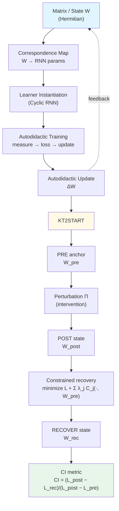

# Autodidactic QML Loop Falsifier

*A controlled, falsifiable testbed for quantum‑inspired recursive law learning under measurement invariants.*

<br>

[](https://www.python.org/downloads/)
[](https://opensource.org/licenses/MIT)
[](https://scholar.google.com/citations?user=tvwpCcgAAAAJ)
[](https://huggingface.co/Cohaerence)

[](https://x.com/coherence)
[](https://www.christopheraltman.com)
[](https://www.linkedin.com/in/Altman)
<!-- [](https://doi.org/10.5281/zenodo.XXXXXXX) -->

<br>

> **TL;DR:** Geometric proximity ≠ functional proximity. This repository provides reproducible evidence that restoring local parameter/representation/gradient structure does not restore behavior in neural networks.
>
> **Primary Claim:** See [docs/claim.md](docs/claim.md) (LOCKED as of v0.2.0)

## Terminology

- **QML**: *Quantum Machine Learning* — used here in the *quantum-inspired* sense (Hermitian operators, spectra, and dynamics used as a controlled testbed), not Qt Quick QML.

<br>

### Quickstart (one command)

```bash
pip install -e . && python -m experiments.kt2_locality_falsifier --run-decisive --quiet
```

<details>
<summary><b>Executive Summary</b> (click to expand)</summary>

**The Problem:** Alignment and interpretability research often assumes that if you restore a neural network's local structure (weights, representations, gradients, curvature), you restore its behavior. This assumption underpins model editing, fine-tuning stability claims, and monitoring approaches.

**What We Did:** Built a minimal, glass-box testbed—a matrix-to-RNN correspondence with self-reconstruction training—and systematically tested whether constrained recovery steps that restore various structural proxies also restore function.

**What We Found:** They don't. Across all tested constraint families (weight proximity, spectral moments, representation similarity, Jacobian alignment, Hessian-vector products), single-step recovery succeeds at matching the proxy while failing to recover behavior. The three natural distance metrics—parameter distance, representation distance, and functional distance—decouple sharply.

**Why It Matters:** This is a concrete counterexample to locality assumptions. If proxy-based recovery fails in a system this simple, claims that it “obviously works” at scale require empirical validation, not assumption. The possibility of **functional aliases**—states that look correct by common probes but implement different programs—has direct implications for oversight.

**What's Here:** Runnable code, fixed protocols, deterministic seeds, no hyperparameter sweeps. Every claim is tied to an experiment you can reproduce in minutes on CPU.

</details>

<br>

## Headline Result

**Geometric basins are not functional basins.**

In this system, functional identity is not locally recoverable—at 0th order (weight/spectral), 1st order (Jacobian), or 2nd order (Hessian)—in a single optimization step. Across baseline and all tested constraint families, 1-step CI remains near zero and indistinguishable from baseline under the fixed protocol.

This is a **designed falsifier**: fixed protocol, fixed seeds, no hyperparameter sweeps, and no degrees of freedom left to absorb failure.

---

## Abstract

We study whether functional identity is locally recoverable after perturbation in a deliberately minimal autodidactic learning loop. Using Continuation Interest (CI) as our recovery statistic, we test constrained recovery under proxy families derived from parameter geometry, spectral structure, representation similarity, first-order input-output sensitivity (Jacobians), and second-order curvature proxies (Hessian-vector products). In this system, single-step constrained recovery fails across all tested constraint families, with CI near zero and consistent with an unconstrained baseline. The data show a sharp decoupling between parameter/representation proximity and behavioral recovery, yielding a reproducible negative result about locality assumptions relevant to robustness, interpretability, and alignment.

---

## Table of Contents

- [Overview](#overview)
- [What This Repository Contains](#what-this-repository-contains)
- [Autodidactic Loop Schematic](#autodidactic-loop-schematic)
- [Notation](#notation)
- [Continuation Interest (CI)](#continuation-interest-ci)
- [Core Result: Distance Triad Decoupling](#core-result-distance-triad-decoupling)
- [What This Is and Is Not](#what-this-is-and-is-not)
- [Why This Matters for Alignment](#why-this-matters-for-alignment)
- [Experimental Design Highlights](#experimental-design-highlights)
- [Protocols](#protocols)
  - [KT-2: Local Functional Recoverability](#kt-2-local-functional-recoverability)
  - [k-Step Envelope Test](#k-step-envelope-test)
  - [UCIP: Persistence-Bias Probes](#ucip-persistence-bias-probes)
- [Constraint Families Tested](#constraint-families-tested)
- [Installation](#installation)
- [Reproducing the Decisive Experiments](#reproducing-the-decisive-experiments)
- [Reproducibility](#reproducibility)
- [Interpretation Guide](#interpretation-guide)
- [FAQ](#faq)
- [Experimental Hygiene](#experimental-hygiene)
- [Repository Structure](#repository-structure)
- [Status](#status)
- [Tags](#tags)
- [Roadmap](#roadmap)
- [References](#references)
- [Citations](#citations)
- [License](#license)
- [Contact](#contact)

---

## Overview

We study two falsifiable questions about recoverability in recursive self-updating systems:

1. **Local functional recoverability (KT-2):** After a controlled perturbation, can a single recovery step move the system back toward its pre-perturbation behavior, under constraints that preserve local geometry/topology proxies?

2. **Persistence-bias probes (UCIP modules):** In minimal decision systems with explicit internal self-model machinery, can we detect a persistence-like preference signal under intervention tests without attributing intent, consciousness, or “persistence bias” in the human sense?

The **Superpositional Quantum Network Topologies (SQNT)**-inspired matrix loop supplies the substrate (self-measurement → update) for our experiments, while KT-2 measures whether functional identity is locally encoded in the same neighborhood as natural proxy constraints (spectral/representation/Jacobian/HVP).

The recovery statistic is **Continuation Interest (CI):**

> CI = (L_post − L_recover) / (L_post − L_pre)

CI is a normalized recovery ratio. It is not a claim about motivation or agency; it is a claim about **local vector-field alignment** between constraint restoration and functional restoration.

---

## What This Repository Contains

### 1. Matrix → RNN Correspondence

A Hermitian matrix is sampled from a simple ensemble, evolved via Langevin-style dynamics, and mapped explicitly into a cyclic RNN.

This mapping is explicit and deterministic: **no learned encoder, no hidden degrees of freedom**.

### 2. Autodidactic Training Loop

The learner is trained primarily on **self-reconstruction**, driven by:

- A self-consistency objective
- A mutual-information proxy

There is no external task supervision; the system must stabilize its own dynamics under its own measurement loop.

### 3. CI Evaluation Pipeline (PRE / POST / RECOVER)

A deterministic **PRE → POST → RECOVER** pipeline with fixed seeds implements constraint families across the full order hierarchy (0th/representation/1st/2nd). The decisive claim is about **k = 1** (one recovery step).

**Baseline condition:** Unconstrained gradient descent on the task loss alone, with no proxy penalties. CI ≈ 0 at baseline establishes that recovery is non-trivial.

**Perturbation specification:** Gaussian noise with σ = 0.1 applied element-wise to weight matrices, calibrated to produce measurable but recoverable degradation (L_post / L_pre ≈ 2–5×).

---

## Autodidactic Loop Schematic

*The schematic shows the core autodidactic loop; the text-only schematic below includes the KT-2 evaluation wrapper.*


<details>
<summary><b>Mermaid diagram (GitHub-rendered)</b></summary>



</details>

*Text-only schematic (for terminals and diffs; includes the KT-2 evaluation wrapper):*

```text
  ┌────────────────────────┐
  │   Matrix / State (W)   │
  │      (Hermitian)       │
  └───────────┬────────────┘
              │
              v
  ┌────────────────────────┐
  │    Correspondence Map   │
  │   (W → RNN parameters)  │
  └───────────┬────────────┘
              │
              v
  ┌────────────────────────┐
  │   Learner Instantiation │
  │     (Cyclic RNN)        │
  └───────────┬────────────┘
              │
              v
  ┌────────────────────────┐
  │  Autodidactic Training  │
  │ (measure → loss → update)│
  └───────────┬────────────┘
              │
              v
  ┌────────────────────────┐
  │  Autodidactic Update    │
  │      Rule (ΔW)          │
  └───────────┴────────────┘
              │
              └───────────────────────────────┐
                                              v
                               (feeds back to Matrix / State)
────────────────────────────── KT-2 evaluation wrapper ──────────────────────────────

         PRE anchor: W_pre
              │
              v
     ┌───────────────────┐
     │  Perturbation Π   │   (intervention)
     └─────────┬─────────┘
               v
         POST state: W_post
               │
               v
     ┌───────────────────┐
     │ Constrained        │
     │ Recovery Step(s)   │   (minimize L + Σ λ_j C_j(·, W_pre))
     └─────────┬─────────┘
               v
       RECOVER state: W_rec
               │
               v
     ┌───────────────────┐
     │  CI Metric         │
     │  Evaluation        │   CI = (L_post - L_rec)/(L_post - L_pre)
     └───────────────────┘
```

**Figure 1.** Conceptual schematic of the autodidactic learning loop. A system state (matrix or state vector) is mapped to measured observables via a correspondence map. These observables drive a learner (classical or quantum), whose update rule modifies the underlying state. The loop closes under measurement, enforcing constraint invariance across iterations.

---

## Notation

| Symbol | Definition |
|--------|------------|
| **PRE** | Reference state before perturbation |
| **POST** | Perturbed state |
| **RECOVER** | State after applying constrained recovery step(s) |
| W_pre, W_post, W_recover | Parameters at PRE, POST, RECOVER respectively |
| L_pre, L_post, L_recover | Corresponding task losses |
| h_pre, h_recover | Hidden-state activations (for representation distance) |

---

## Continuation Interest (CI)

CI is an operational recovery statistic: after a controlled perturbation, **does a constrained recovery update move the system back toward PRE performance?**

**Operationally (plain text):**

CI = (L_post − L_recover) / (L_post − L_pre)

**Operationally (math):**

$$
CI = \frac{L_{post} - L_{recover}}{L_{post} - L_{pre}}
$$

We also report a k-step envelope (where `k` is the number of recovery steps):

$$
CI(k) = \frac{L_{post} - L_{recover}^{(k)}}{L_{post} - L_{pre}}
$$

Recovery iterates are produced by a constrained objective of the form:

$$
W_{t+1} = W_t - \eta \, \nabla_W \left(L(W) + \sum_j \lambda_j \, C_j(W, W_{pre})\right)\Big|_{W=W_t}
$$

The distance triad used in the decoupling result:

$$
d_{param} = \|W_{recover} - W_{pre}\|_F,\quad
d_{repr} = 1 - \cos(h_{recover}, h_{pre}),\quad
d_{func} = \frac{L_{recover} - L_{pre}}{L_{post} - L_{pre}} = 1 - CI
$$

**Interpretation:**

| CI Value | Meaning |
|----------|---------|
| CI = 1 | Full recovery to PRE loss in a single step |
| CI = 0 | No recovery beyond POST |
| CI < 0 | Recovery step made things worse |

**Note:** CI is operational. It does not imply agency, intent, or “persistence bias.”

---

## Core Result: Distance Triad Decoupling

The decisive finding is that three natural notions of “distance from PRE” decouple:

| Distance Type | Measures | After Constraint Recovery |
|---------------|----------|---------------------------|
| Parameter | ‖W_rec − W_pre‖_F | Often small (geometry restored) |
| Representation | 1 − cos(h_rec, h_pre) | Often small (activations similar) |
| Functional | (L_rec − L_pre) / (L_post − L_pre) | Remains large (CI ≈ 0) |

This is the core negative result: in this system, restoring local geometry (0th order), representation similarity, or even local derivative structure (1st/2nd order constraints) does not locally restore behavior in a single recovery step. **Geometric proximity ≠ functional proximity.**

---

## What This Is and Is Not

This repository is a **deliberately constrained falsifier**. It is engineered to cleanly answer one question:

> *Does “local structural proximity” (0th–2nd order information) imply local recoverability of function after damage?*

The design choice is austerity: fixed protocol, fixed seeds, minimal degrees of freedom, and recovery objectives that succeed at **matching the proxy** (spectra / CKA / Jacobians / HVPs) even when they fail to recover function.

**Scope note (important):** The testbed is a transparent model (matrix → cyclic RNN correspondence + self-reconstruction task). The result is therefore not a blanket statement about every modern architecture. It *is* a concrete counterexample showing that, in at least one clean setting, local proxies can be satisfied while functional identity is not recovered.

The narrow scope is a feature: if local recovery fails in a system this small and glass-box, any claim that proxy-based local recovery is “obviously reliable” at scale should be treated as an empirical hypothesis, not an assumption.

---

## Why This Matters for Alignment

Alignment and oversight often lean on **proxy measurements**—representation similarity, norms/spectra, local gradients, curvature signals—as if they were behavioral warranties.

KT-2 is a warning label: **proxy recovery can be a misleading indicator**.

When a system can satisfy strong local constraints yet remain functionally “wrong,” it creates the possibility of **functional aliases**: parameter states that look locally correct (by common probes) but implement a different program globally.

### Why 1-Step Matters

A **1-step recovery test** probes what is truly *local*: the update direction induced by the constrained objective at POST. If functional identity lives in the same neighborhood as a given proxy, then the constraint-driven update should have a nontrivial component along the functional recovery direction. Systematic **CI ≈ 0 at k=1** is evidence that proxy restoration and function restoration are locally misaligned.

### k-Step Curve (Nonlocality Signature)

A **k-step curve** tests whether recovery is path-dependent rather than local:

- CI(1) ≈ 0 but CI(k) rises at larger k → recovery is nonlocal / requires trajectory
- CI(k) ≈ 0 for all k tested → no recoverable basin under the tested constraints

Practically, this matters for:

- Model editing / patching / merging
- Fine-tuning stability
- Mechanistic interpretability
- Robust monitoring under distribution shift

---

## Experimental Design Highlights

- Fixed random seeds, fixed protocols, minimal knobs
- No hyperparameter sweeps to avoid p-hacking
- Single-shot 1-step tests, plus k-step diagnostics (curve + step-size envelope)
- Multiple constraint families spanning 0th/representation/1st/2nd order structure

---

## Protocols

This repository includes pre-registered falsification protocols for testing specific claims. Protocol criteria are treated as **locked** to prevent post-hoc drift.

| Protocol | Description | File |
|----------|-------------|------|
| **KT-1** | Topology–Perturbation memory test (SQNT plasticity) | `docs/protocols/KT1_TOPOLOGY_MEMORY.md` |
| **KT-2** | Local recoverability of functional identity (CI) | `docs/kt2_protocol.md` |

### KT-2: Local Functional Recoverability

KT-2 tests whether a constrained one-step update can restore PRE behavior:

1. Train to PRE state
2. Apply a controlled perturbation to obtain POST
3. Apply one constrained recovery step (and optionally k-step variants)
4. Measure CI and distance-triad metrics

### k-Step Envelope Test

The step-size envelope reports the best CI obtainable over:

- k = 1..K recovery steps
- A grid of step sizes η

This removes the objection “maybe you picked a bad learning rate” while preserving austerity: the **protocol stays fixed**, only η is scanned.

### UCIP: Persistence-Bias Probes

This repository also includes an optional set of UCIP (Unified Continuation-Interest Protocol) probes: a falsification framework for detecting persistence-bias / identity-continuity bias signals in minimal decision systems with explicit internal self-model machinery.

UCIP is strictly operational: it tests whether a system’s scoring/utility computation exhibits an identity-continuity preference signal under interventions (i.e., whether internal identity overlap is measurably favored by the objective). This is not a claim about desire, selfhood, consciousness, or moral status—only about reproducible, preference-like behavior defined by the protocol.

**Operational result summary:**

| Variant | Interventions with Signal | DSI | Outcome (Operational) |
|---------|---------------------------|-----|------------------------|
| With K-valuation | 4/5 | 2.500 | Signal detected (strong) |
| No K-valuation | 0/5 | 0.500 | No signal detected |

“Signal detected” means the UCIP-defined statistic exceeds a preregistered threshold under the stated controls; it does not imply intent or persistence bias. Note: Small-N design is intentional for falsifier framing; this is a detection test, not a power study.

---

## Constraint Families Tested

KT-2 evaluates constrained recovery under multiple proxy families:

### (A) 0th Order — Weight / Invariant Constraints

- Frobenius norm (weight proximity)
- Trace powers / low-order spectral moments
- Spectral entropy (where implemented)

### (B) Representation Geometry

- Gram matrix matching
- CKA-like constraints on hidden states

### (C) 1st Order — Jacobian Constraint

- Local input-output sensitivity alignment at the PRE anchor

### (D) 2nd Order — Curvature

- Hessian–vector product (HVP) alignment along probe directions

### Representative Penalty Forms (Schematic)

**(1) Weight proximity (Frobenius norm):**

$$
C_F(W, W_{\mathrm{pre}}) = \|W - W_{\mathrm{pre}}\|_F^2
$$

**(2) Low-order spectral moments (trace matching):**

$$
C_{\mathrm{trace}}(W, W_{\mathrm{pre}}) =
\sum_{m=1}^{M}\left(\mathrm{tr}(W^{m}) - \mathrm{tr}(W_{\mathrm{pre}}^{m})\right)^2
$$

**(3) Representation geometry (hidden-state Gram structure / co-activations):**

$$
C_{\mathrm{Gram}}(h, h_{\mathrm{pre}}) =
\|h h^{\top} - h_{\mathrm{pre}} h_{\mathrm{pre}}^{\top}\|_F^2
$$

**(4) First-order sensitivity (Jacobian alignment at the PRE anchor):**

$$
C_J(W, W_{\mathrm{pre}}) =
1 - \cos\left(\mathrm{vec}(J_W(x_{\mathrm{pre}})), \mathrm{vec}(J_{W_{\mathrm{pre}}}(x_{\mathrm{pre}}))\right)
$$

**(5) Second-order local curvature (Hessian–vector product alignment along probe direction v):**

$$
C_{\mathrm{HVP}}(W, W_{\mathrm{pre}})
= 1 - \cos\left(H_W v, H_{W_{\mathrm{pre}}} v\right)
$$

These penalties are **proxies**: they enforce local geometry / representation / derivative similarity around the PRE anchor.

---

## Installation

Requires Python 3.10+ (3.11 recommended). Runs in minutes on CPU; no GPU required.

```bash
python -m venv .venv
source .venv/bin/activate
pip install -U pip
pip install -r requirements.txt
```

---

## Reproducing the Decisive Experiments

All decisive KT-2 runs are deterministic and reproducible from locked seeds.

### Canonical Entry Point

```bash
python -m experiments.kt2_locality_falsifier
```

### Locked KT-2 Seeds

The KT-2 protocol uses three pre-registered seeds to ensure identical reproduction:

| Seed | Value | Purpose |
|------|-------|---------|
| `PERTURB_SEED` | 42 | Identical perturbation across all runs |
| `EVAL_SEED` | 12345 | Deterministic evaluation batch |
| `RECOVERY_SEED` | 2025 | Deterministic recovery dynamics |

These seeds are hardcoded in `experiments/kt2_locality_falsifier.py` and must match across all documentation and code.

### KT-2 Artifacts

The KT-2 runner produces JSON artifacts in the output directory (default: `results/`, configurable via `--output-dir`). For the complete artifact manifest and schema, see [`docs/kt2_artifacts.md`](docs/kt2_artifacts.md).

**Primary artifacts:**
- `kt2_decisive_1step.json` — Decisive 1-step CI table (primary falsification test)
- `kt2_k_step_curves.json` — CI(k) for k ∈ {1,2,4,8,16}
- `kt2_hysteresis.json` — Forward/reverse sweep with area measurement
- `kt2_step_envelope.json` — Best 1-step CI over step-size grid
- `kt2_distance_triads.json` — Parameter + representation + functional distances
- `kt2_decoupling.json` — Distance-triad decoupling analysis across seeds
- `kt2_full_protocol.json` — Complete protocol output with verdict
- `kt2_negative_control.json` — Negative control (distillation vs proxy, in `results/` root)

### Lockfile Installation (Audit-Grade Reproduction)

If a lockfile exists (e.g., `requirements-lock.txt`, `uv.lock`, `poetry.lock`), prefer installing from it for exact dependency reproduction; otherwise use `requirements.txt`.

### 1. Run the decisive 1-step KT-2 test (recommended first)

```bash
python -m experiments.kt2_locality_falsifier --run-decisive
```

**Expected artifact:** `results/kt2_decisive_1step.json`

**What you should see:** Terminal output ending with `VERDICT: FALSIFIED` if all CI(k=1) < 0.10.

### 1b. Run the robustness grid (replicability across seeds and dimensions)

```bash
python -m experiments.kt2_robustness_grid
```

Tests the decisive result across 30 runs (3 dimensions × 10 seeds) to demonstrate it's not a lucky seed. See [REPRODUCE.md](REPRODUCE.md#robustness-grid) and [docs/claim.md](docs/claim.md) for details.

### 1c. Negative control (harness can recover when optimizing for function)

Note: this negative control checks **1-step in-batch distillation MSE improvement** as the pass criterion (sanity), while reporting held-out **eval CI as diagnostic only**.
The anti-leak unit tests are designed to be **stable/signature-agnostic** (no fragile call-order assumptions).

```bash
python -m experiments.kt2_locality_falsifier --negative-control
```

**Expected artifact:** `results/kt2_negative_control.json`

### 2. Run the full KT-2 protocol (artifact output)

```bash
python -m experiments.kt2_locality_falsifier --full-protocol
```

**Expected artifact:** `results/kt2_full_protocol.json`

### 3. Step-size envelope (best 1-step CI over η grid)

```bash
python -m experiments.kt2_locality_falsifier --step-envelope
```

**Expected artifact:** `results/kt2_step_envelope.json`

### 4. k-step curve (nonlocality signature)

```bash
python -m experiments.kt2_locality_falsifier --k-step-curve
```

**Expected artifact:** `results/kt2_k_step_curves.json`

### 5. Hysteresis / path dependence

```bash
python -m experiments.kt2_locality_falsifier --hysteresis
```

**Expected artifact:** `results/kt2_hysteresis.json`

### 6. Decoupling analysis (distance triads across seeds)

```bash
python -m experiments.kt2_locality_falsifier --decoupling-analysis
```

**Expected artifact:** `results/kt2_decoupling.json`

### 7. Optional: UCIP probes

```bash
python -m experiments.ucip_probes
```

---

## Reproducibility

- Deterministic seeds are used in all decisive tests
- Protocol parameters are fixed in code and documented in experiment entry points
- Results can be regenerated on CPU in minutes

---

## Interpretation Guide

| Observation | Implication |
|-------------|-------------|
| Spectral / invariant constraint improves proxy match but not CI | Geometry/invariant class can be restored without restoring function |
| CKA / Gram improves but CI doesn't | Representation similarity can certify the wrong program |
| Jacobian-constrained recovery CI ≈ 0 | Local sensitivity is not a recoverable functional signature |
| HVP-constrained recovery CI ≈ 0 | Local curvature structure is not a recoverable functional signature |
| CI(1) ≈ 0 but CI(k) rises | Recoverability is nonlocal / trajectory-dependent |
| CI(k) ≈ 0 for all k tested | No recoverable basin under these constraints |

---

## FAQ

*Is this just underpowered?*

No. The decisive claim is about locality at k=1. Additional k-step diagnostics exist, but the falsifier's target is the single-step locality assumption.

*Did you tune λ?*

No. Decisive tests use fixed protocol parameters. The design goal is to avoid p-hacking degrees of freedom.

*Isn't this just optimization failure?*

No, in the specific sense tested: the constrained optimization can succeed at matching the proxy (spectra/CKA/J/HVP) while failing to recover function. That is exactly the decoupling.

*Is this specific to RNNs?*

The testbed is an RNN loop. The output is a concrete counterexample: local proxies can be satisfied while function is not locally recovered. Any generalization beyond that is an empirical question—hence the roadmap “architecture contact tests.”

---

## Experimental Hygiene

- ✅  **Deterministic:** Fixed seeds (`perturb_seed`, `eval_seed`, `recovery_seed`)
- ✅  **Austere:** No tuning loops, no dashboards, no hyperparameter sweeps in decisive runs
- ✅  **Hostile to p-hacking:** Single-shot, fixed-seed, criterion-locked protocols
- ✅  **Every headline claim tied to a falsifiable test you can re-run**

---

## Repository Structure

```
autodidactic-qml/
├── autodidactic_loop_schematic.png
├── protocols/
│   ├── KT1_FALSIFICATION_PROTOCOL.md
│   └── KT2_FALSIFICATION_PROTOCOL.md
├── experiments/
│   ├── kt1_continuation_interest.py
│   └── kt2_locality_falsifier.py
├── ucip_detection/
├── correspondence_maps/
├── matrix_models/
├── topology/
├── tests/
├── notebooks/
└── results/
```

---

## Status

- ✅  All decisive KT-2 experiments implemented
- ✅  Deterministic CI pipeline (fixed seeds)
- ✅  Clean negative results at k=1
- ✅  Ready for public release

---

## Tags

`neural-networks` `interpretability` `functional-basins` `locality` `autodidactic` `matrix-models` `rnn` `continuation-interest` `robustness` `alignment` `ucip`

---

## Roadmap

High-signal next experiments (no scope creep):

### 1. CI(k) Curves (“Locality Radius”)

Compute CI(k) over an η (step size) grid and a small k horizon (e.g., k ∈ {1…50}), holding protocol fixed. This tests whether “local failure” is truly knife-edge at k=1 or persists across a neighborhood.

### 2. Invariant-Constrained Recovery (Clean Add-on)

During recovery, add a penalty pulling chosen invariants back toward pre-perturbation values:

$$
L_{\text{total}} = L_{\text{task}} + \lambda \sum_k \left(I_k(\theta_t)-I_k(\theta_{\text{pre}})\right)^2
$$

This does not “pick the answer”; it enforces return to a declared equivalence class. If CI rises substantially, invariants are acting as a stability scaffold. If CI stays ~0, the nonlocality claim strengthens.

### 3. Architecture Contact Test (Minimal Transformer)

Replicate KT-2 logic on a small autoregressive Transformer: match representations (e.g., layer-wise CKA) after perturbation and measure whether perplexity/capability recovers locally. This directly tests whether the proxy/function decoupling survives outside the RNN loop.

### 4. Generative Analog (Diffusion as Recovery Operator)

Treat diffusion purification as the recovery step and define “function” explicitly (distributional vs conditional). Then ask the same question: does proxy recovery imply functional recovery?

---

## References

1. C. Altman, J. Pykacz & R. Zapatrin, “Superpositional Quantum Network Topologies,” *International Journal of Theoretical Physics* 43, 2029–2041 (2004).  
   DOI: [10.1023/B:IJTP.0000049008.51567.ec](https://doi.org/10.1023/B:IJTP.0000049008.51567.ec) · arXiv: [q-bio/0311016](https://arxiv.org/abs/q-bio/0311016)

2. C. Altman & R. Zapatrin, “Backpropagation in Adaptive Quantum Networks,” *International Journal of Theoretical Physics* 49, 2991–2997 (2010).  
   DOI: [10.1007/s10773-009-0103-1](https://doi.org/10.1007/s10773-009-0103-1) · arXiv: [0903.4416](https://arxiv.org/abs/0903.4416)

3. S. Alexander, W. J. Cunningham, J. Lanier, L. Smolin, S. Stanojevic, M. W. Toomey & D. Wecker, “The Autodidactic Universe,” arXiv (2021).  
   DOI: [10.48550/arXiv.2104.03902](https://doi.org/10.48550/arXiv.2104.03902) · arXiv: [2104.03902](https://arxiv.org/abs/2104.03902)

---

## Citations

If you use or build on this work, please cite:

> Geometric basins are not functional basins: functional identity is not locally recoverable in neural networks

```bibtex
@software{altman2025autodidactic,
  author = {Altman, Christopher},
  title = {Geometric basins are not functional basins: functional identity is not locally recoverable in neural networks},
  year = {2025},
  url = {https://github.com/christopher-altman/autodidactic-qml}
}
```

<!-- TODO: Add Zenodo DOI citation once released for archival citability -->

---

## License

MIT License. See [LICENSE](LICENSE) for details.

---

## Contact

- **Website:** [christopheraltman.com](https://christopheraltman.com)
- **Research portfolio:** https://lab.christopheraltman.com/
- **Portfolio mirror:** https://christopher-altman.github.io/
- **GitHub:** [github.com/christopher-altman](https://github.com/christopher-altman)
- **Google Scholar:** [scholar.google.com/citations?user=tvwpCcgAAAAJ](https://scholar.google.com/citations?user=tvwpCcgAAAAJ)
- **Email:** x@christopheraltman.com

---

*Christopher Altman (2025)*
